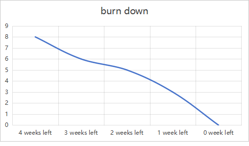

# Actual iteration-1 board, (see chapters 3 and 4), add your start and end dates 

Checklist: 
1. github entry timestamps
2. User stories are correct: see p39

* Assumed Velocity: 20 hours
* Number of developers: 2
* Total estimated amount of work: 8 days

User stories or tasks (see chapter 4):
1. [sign up](../user_stories/sign_up.md), priority 10, 3 days(24 hours) 
2. [information fill](../user_stories/information_fill.md), priority 10, 1 days(8 hours)
3. [login](../user_stories/login.md), priority 10, 2 days(16 hours)
4. [data record](../user_stories/datarecord.md), priority 10, 2days(16 hours)

In progress:
* Task-2 (developer name or initials), date started
* Jiahao Song
* Jiale Tan
* date started: Jun 19, 2024

Completed:
* Task-3 (developer name or initials), date completed
* Jiahao Song
* Jiale Tan
* date completed: Jul 10, 2024

### Burn Down for iteration-1 (see chapter 4):
Update this at least once per week
* 4 weeks left, 8 days of estimated amount of work 
* 3 weeks left, 6 days
* 2 weeks left, 5 days
* 1 weeks left, 3 days
* 0 weeks left, 0 days
* Actual Velocity: 2 days per week
* 
