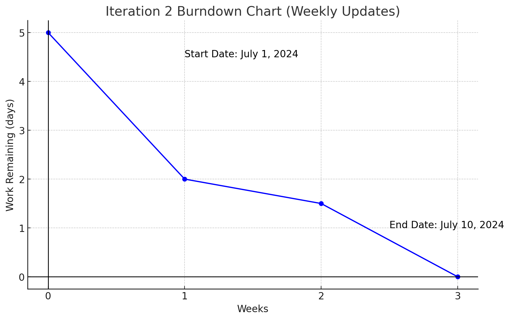

# Actual iteration-2 board, (see chapters 3 and 4), add your start and end dates 

Checklist: 
1. github entry timestamps
2. User stories are correct: see p39

* Assumed Velocity FROM iteration-2: 12 hours
* Number of developers: 2
* Total estimated amount of work: 5 days

User stories or tasks (see chapter 2):The user_story release task originally planned was cancelled due to the comprehensive consideration of insufficient time and insufficient function availability
1. [creat_course](../user_stories/creat_course.md), priority 20, 3 days 
2. [online_video](../user_stories/online_video.md), priority 30, 1 days
3. The user story was canceled. The scheduled release task was canceled

In progress:
* Task-2 (developer name or initials), date started
* Jiahao Song
* Jiale Tan
* date started: June 22 , 2024

Completed:
* Task-3 (developer name or initials), date completed
* Jiahao Song
* Jiale Tan
* date started: July 10 , 2024

### Burn Down for iteration-2 (see chapter 4):
Update this at least once per week
* 3 weeks left, 5 days
* 2 weeks left, 2 days
* 1 weeks left, 1.5 days
* 0 weeks left， 0 days
* Actual Velocity: 
* 