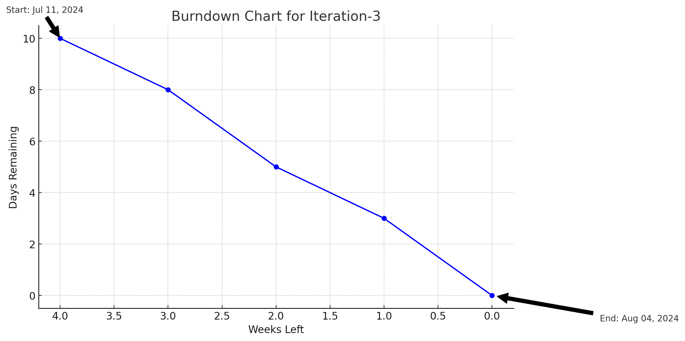

# Actual iteration-3 board, (see chapters 3 and 4), add your start and end dates

Checklist:
1. github entry timestamps
2. User stories are correct: see p39

* Assumed Velocity FROM iteration-3: 20 hours
* Number of developers: 2
* Total estimated amount of work: 10 days

User stories or tasks (see chapter 2):
1. [select_course](../user_stories/select_course.md), priority 20, 4 days
2. [feedback](../user_stories/feedback.md), priority 30, 1 days
3. [improve_system](../user_stories/improve_system.md), priority 40, 3 days
4. [adjust_function](../user_stories/adjust_function.md), priority 40, 3 days

In progress:
* Task-2 (developer name or initials), date started
* Jiahao Song (developer)
* Jiale Tan (interface designer)
* date started: July 11 , 2024

Completed:
* Task-3 (developer name or initials), date completed
* Jiahao Song
* Jiale Tan
* date started: August 4, 2024

### Burn Down for iteration-3 (see chapter 4):
Update this at least once per week
* 4 weeks left, 10 days
* 3 weeks left, 8 days
* 2 weeks left, 5 days
* 1 weeks left, 3 days
* 0 weeks left， 0 days
* Actual Velocity:
* 