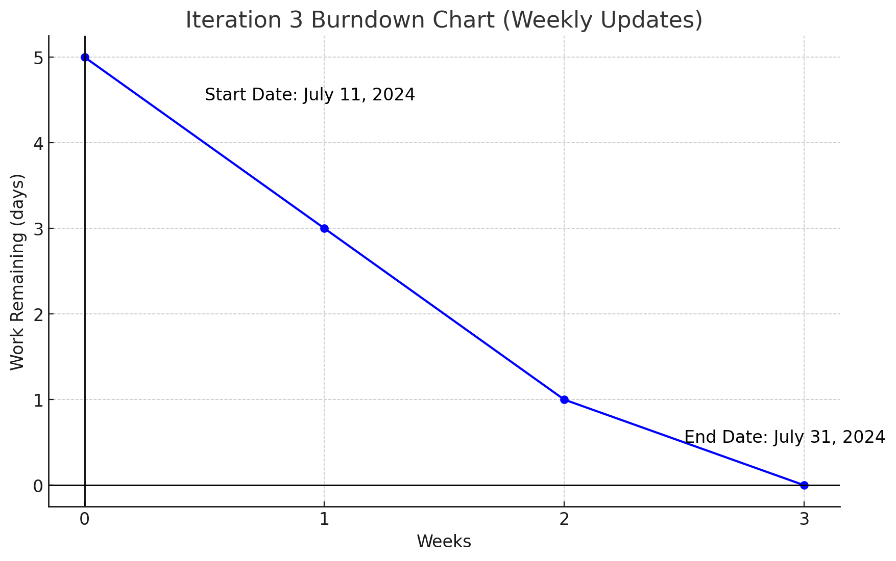

# Actual iteration-4 board, (see chapters 3 and 4), add your start and end dates

Checklist:
1. github entry timestamps
2. User stories are correct: see p39

* Assumed Velocity FROM iteration-4: 10 hours
* Number of developers: 2
* Total estimated amount of work: 6 days

User stories or tasks (see chapter 2):
1. [improve_system](../user_stories/improve_system.md), priority 50, 3 days
2. [adjust_function](../user_stories/adjust_function.md), priority 50, 3 days

In progress:
* Task-2 (developer name or initials), date started
* Jiahao Song
* Jiale Tan
* date started: June 30 , 2024

Completed:
* Task-3 (developer name or initials), date completed
* Jiahao Song
* Jiale Tan
* date started: July 31 , 2024

### Burn Down for iteration-4 (see chapter 4):
Update this at least once per week
* 4 weeks left,  days
* 3 weeks left,  days
* 2 weeks left,  days
* 1 weeks left,  days
* 0 weeks left，  days
* Actual Velocity:
* 