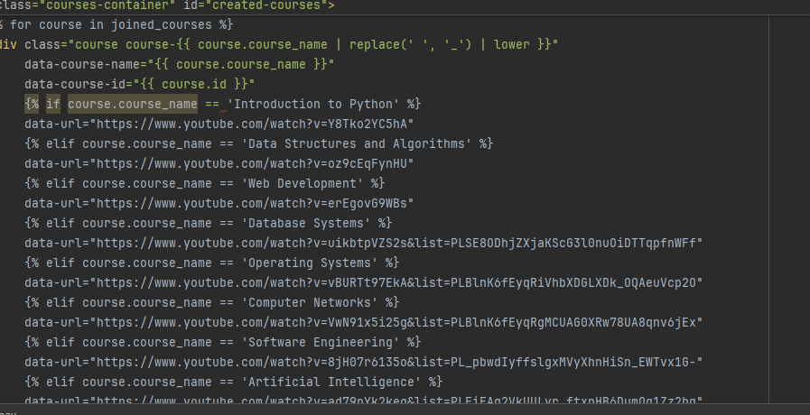

# User story title: adjust_function
## Priority: 50 (latest for iteration-1)
## Priority: 50 (latest for iteration-2)
## Priority: 50 (latest for iteration-3)
## Priority: 50 (latest for iteration-4)

## Estimation: 1 days
* Jiahao Song: 1 day
* Jiale Tan: 1 day

## Assumptions (if any):
the data will be stored in the database when registered information completed

## Description-v1: Later logins require verifying the existence of the account from the database
Later logins will include a verification step to ensure the account exists in the database before granting access.

## Tasks:
1. Task 1: improve interface, Estimation 1 day
2. Task 2: creat more database table, Estimation 1day
3. Task 3: add background for each interface, Estimation 1day
4. Task 4: add URL resources for courses function, Estimation 1 day

# UI Design:
* (New, not in the textbook)

# Completed:
# With each iteration, corresponding functional adjustments are made
# that's picture is about add URL resource other adjust screenshot have been showed to other user_story
 

