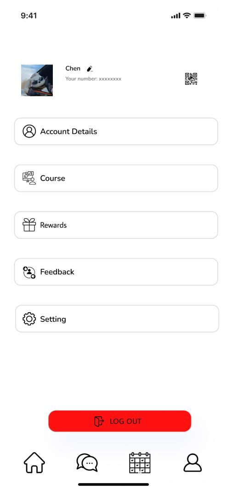

# User story title: adjust_function
## Priority: 50 (latest for iteration-1)
## Priority: 50 (latest for iteration-2)
## Priority: 50 (latest for iteration-3)
## Priority: 50 (latest for iteration-4)

## Estimation: 1 days
* Jiahao Song: 1 day
* Jiale Tan: 1 day

## Assumptions (if any):
the data will be stored in the database when registered information completed

## Description-v1: Later logins require verifying the existence of the account from the database
Later logins will include a verification step to ensure the account exists in the database before granting access.

## Tasks:
1. Task 1:Design and Implement Information Fill Interface, Estimation 1 day
2. Task 2: Backend Logic and Database Integration, Estimation 1day
3. Task 3: Login Verification Functionality, Estimation 1day
4. Task 4: Access Control ,Estimation 1 day

# UI Design:
* (New, not in the textbook)
* 
* https://www.figma.com/design/x5H44M9Qn34B1flDiPB7gV/CP3407?node-id=0- 1&t=J5QMXXerU4TbwwtP-0

# Completed:
# this is fill information screenshot

# this is show this fill information have already saved in database.

