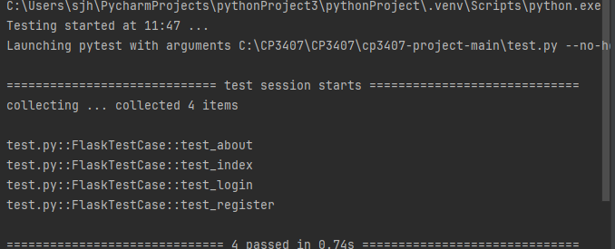

# User story title: Test
## Priority: 10 (latest for iteration-4)

## Estimation: 1 days
* Jiahao Song: 1 day
* Jiale Tan: 1 day

## Assumptions (if any):

## Description-v1: Use a white box to test whether the code works properly

## Tasks:
1. Task 1:Design and Implement Information Fill Interface, Estimation 1 day
2. Task 2: Backend Logic and Database Integration, Estimation 1day
3. Task 3: Login Verification Functionality, Estimation 1day
4. Task 4: Access Control ,Estimation 1 day

# UI Design:
* (New, not in the textbook)
* 

# Completed:
# first test
*

# test successfully

