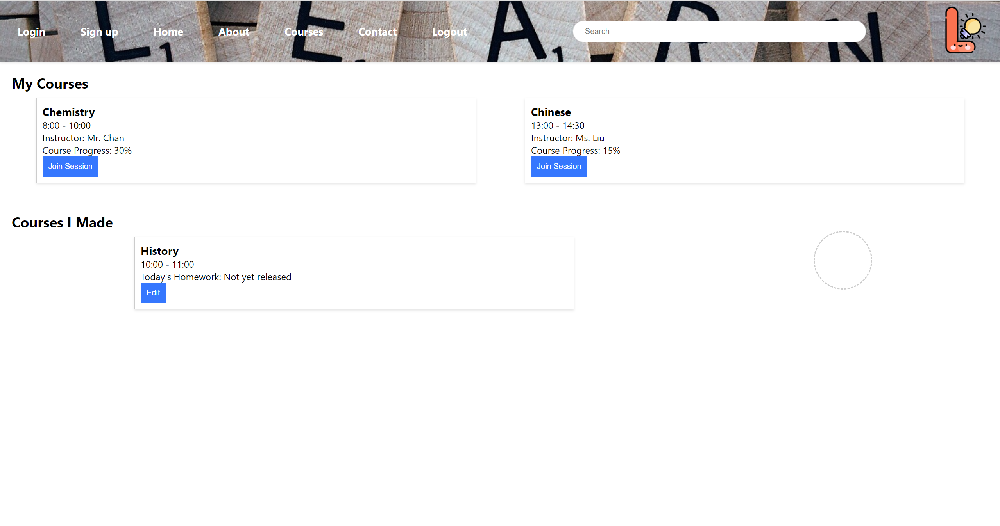
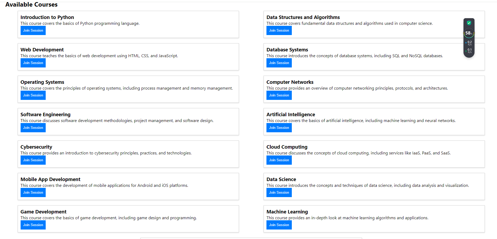
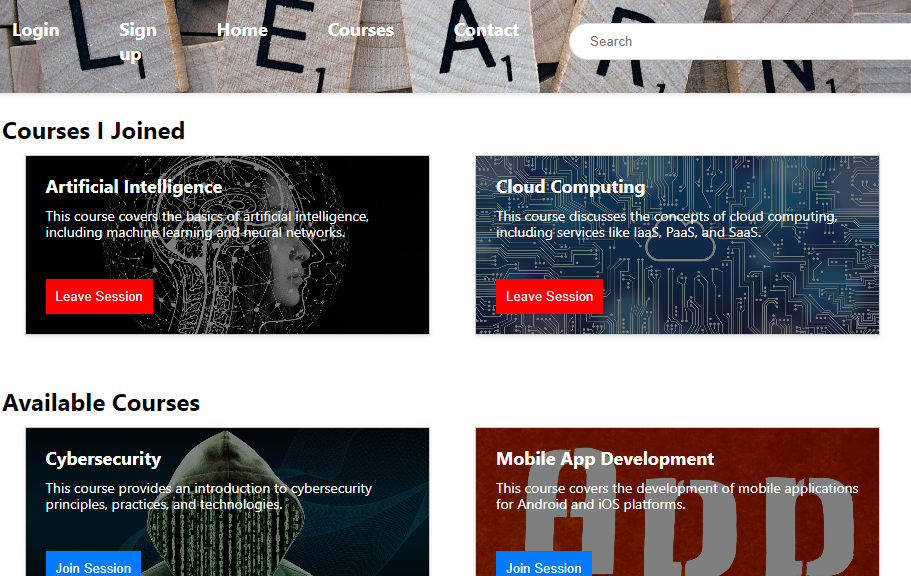
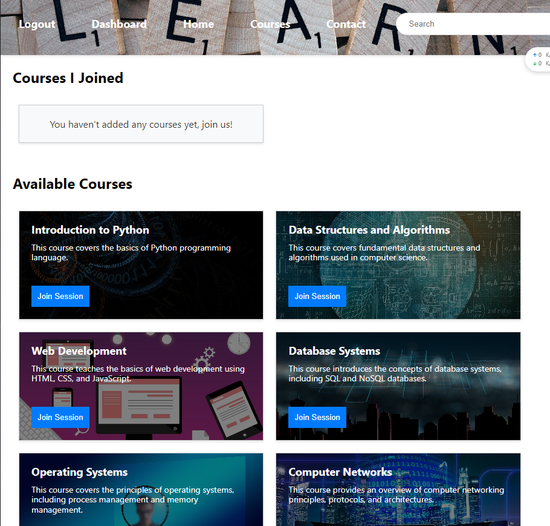

Create more md files like this one as needed. Place them into the same folder
as this [user_stories folder](./)

# User story title: course(change project this user_story name: creat course to course)
## design simple interface

## access database to get courses information and select courses
 

## Priority: 20 (latest for iteration-2)
The priority in iteration2 is 20

## Estimation: e.g. 2 days
Any notes on estimation go here. Keep your planning poker game numbers. For example
* JiahaoSong: 4 days 
* JialeTan: 3 days

## Assumptions (if any): After the student selects the course, the selected subject will be saved in the user's data table

## Description: e.g. The web page will show current deals to Orion's orbits users
Description-v2:In iteration2 database include courses information

## Tasks, see chapter 4.
1. Task 1: Add styling to the interface, Estimation 1 day
2. Task 2: Access database to get courses information  , Estimation 1 day
3. Task 3: The selected course is saved in the user table
4. Beautify the interface

# UI Design:
* (New, not in the textbook)
* Many user stories are connected to a User interface.
* Insert a mockup design screenshot using any prototyping tools, e.g. [https://ninjamock.com/](https://ninjamock.com/)

# Completed:
## version-1
* 
## version-2
* 
## version-3
*
## version-4
You can access the course interface only after logging in successfully. If you do not log in, click the course interface to jump to the login interface
* 

