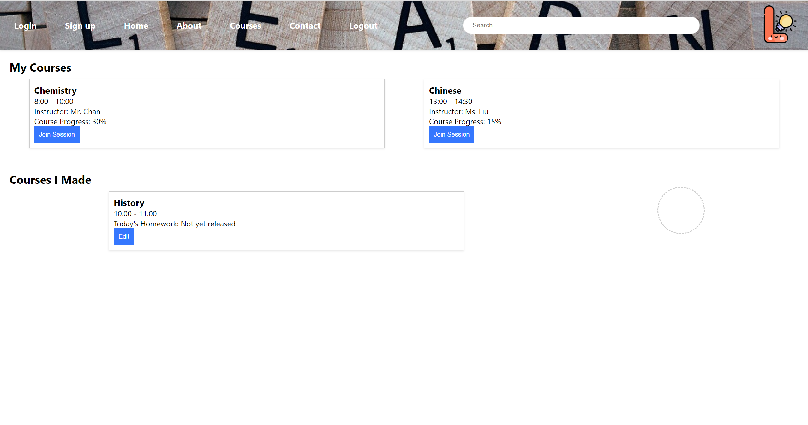

Create more md files like this one as needed. Place them into the same folder
as this [user_stories folder](./)

# User story title: course(change project this user_story name: creat course to course)
design simple interface

## Priority: 20 (latest for iteration-2)
The priority in iteration1 is 20

## Estimation: e.g. 2 days
Any notes on estimation go here. Keep your planning poker game numbers. For example
* Bob: 1 day (e.g. estimated before iteration-1)
* Lisa: 2 days
* Jack: 3 days

## Assumptions (if any):

## Description: e.g. The web page will show current deals to Orion's orbits users
You need to keep all versions here so that your instructor/marker can see your changes easily.
In a real project, your older versions could be viewed via commits.

Description-v1: e.g. The web site will show current deals to Orion's orbits users

## Tasks, see chapter 4.

1. Task 1, Estimation XX days
2. ...

# UI Design:
* (New, not in the textbook)
* Many user stories are connected to a User interface.
* Insert a mockup design screenshot using any prototyping tools, e.g. [https://ninjamock.com/](https://ninjamock.com/)

# Completed:
* (New, not in the textbook)
* Insert screenshots of completed.
* If you have multiple versions (changes between iteractions), show them all.

