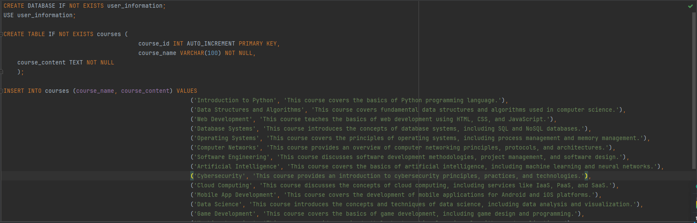
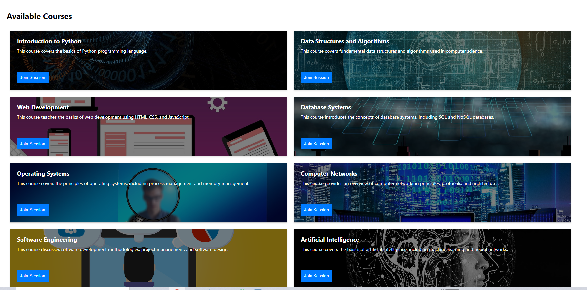

Create more md files like this one as needed. Place them into the same folder
as this [user_stories folder](./)

# User story title: Creat Course
## Create courses in sql

## Priority: 20
This is the latest priority for iteration-2.

## Estimation: 3 days
* Jiahao Song: 2 day (estimated before iteration-2)
* Tanjia Le: 1 day( estimated before iteration-1 design interface)

## Assumptions (if any):
Create a course catalog in a sql database

## Description: Later logins require verifying the existence of the account from the database
Description-v2: Creat course in a sql database.
Description-v3: The selection of subjects can be seen through the select course website interface
Description-v4: After logging in to your account, you can select a subject through the select_course portal and record it in the user_course database
Description-v5: The selection and removal of subjects will be recorded in real time, and the course selected by the user's email will be displayed directly in the Course interface after login

## Tasks,see chapter 4
1. Task 1: Create database connection, Estimation 1 day
2. Task 2: Save the data in the database Estimation 1 day
3. Task 3: Save the created course information in a database, Estimation 1 day
4. Task 4: Add styling to the interface, Estimation 1 day

# UI Design:
* (New, not in the textbook)
* https://www.figma.com/design/x5H44M9Qn34B1flDiPB7gV/CP3407?node-id=0- 1&t=J5QMXXerU4TbwwtP-0

# Completed: just one version

# created course to show the website

