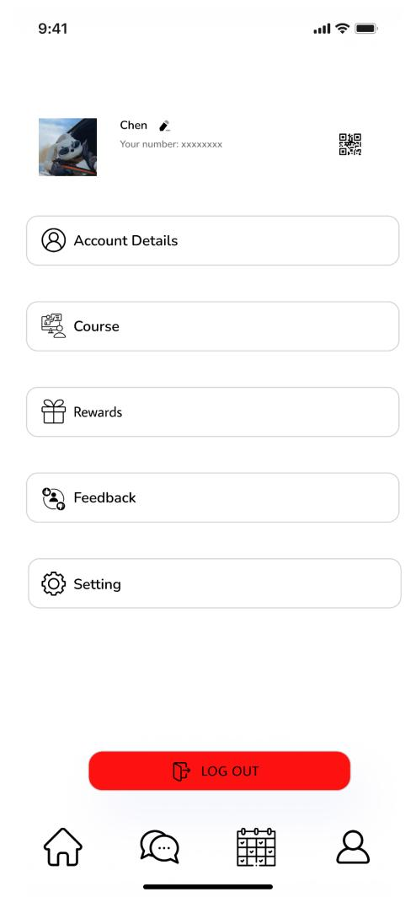

# User story title: data record 
## Priority: 10 (latest for iteration-1)
The priority in iteration1 is 10

## Estimation: 2 days
* Jiahao Song: 2 day (estimated before iteration-1)

## Assumptions (if any):
The database created during this process will continue to be used later

## Description: This step saves the information entered by the user to the database
Description-v1:In iteration1 database only the data entered in register is saved as database

 

## Tasks, see chapter 3.

1. Task 1, set up a database, Estimation 1 days
2. Task 2, Registered accounts can be saved in the database, Estimation 1 days
3. Task 3, During login, the account and password are verified to exist in the database

# UI Design:
* (New, not in the textbook)
* Many user stories are connected to a User interface.
* Insert a mockup design screenshot using any prototyping tools, e.g. [https://ninjamock.com/](https://ninjamock.com/)

# Completed:
iteration1: only 1 tables