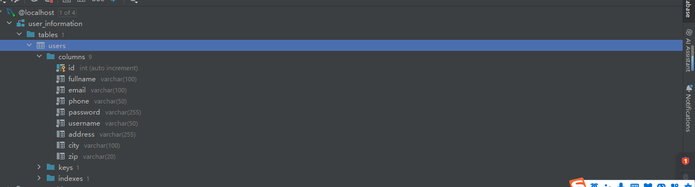
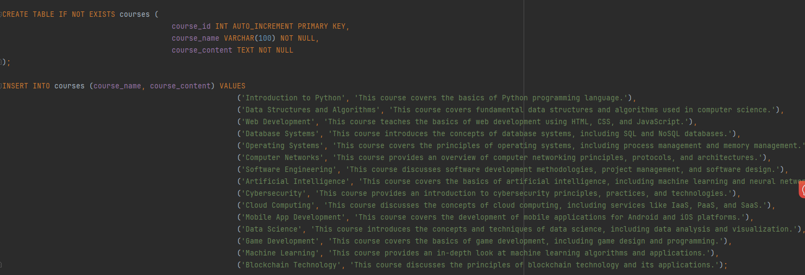
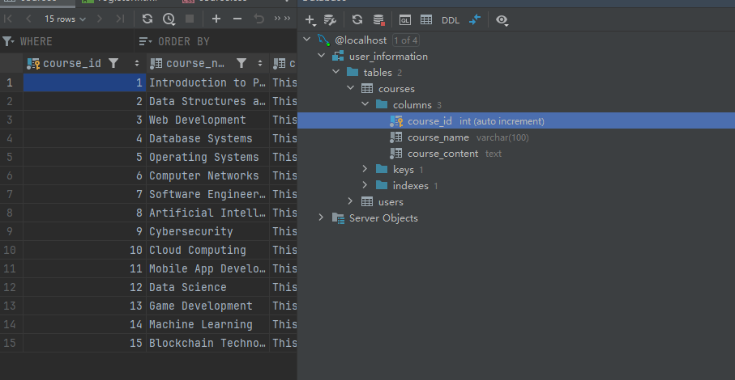
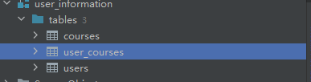
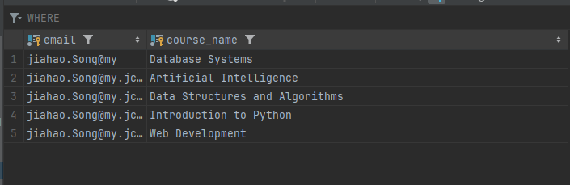
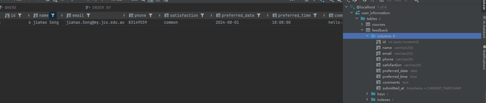
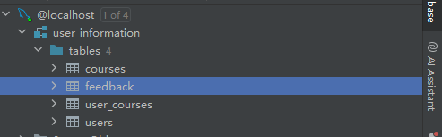

# User story title: database

## Priority: 10 (latest for iteration-1)
## Priority: 10 (latest for iteration-2)
## Priority：10 （iteration-3）

## Estimation: 2 days
* Jiahao Song: 2 day (estimated before iteration-1)
* Jiahao Song: 3 day (estimated before iteration-2)

## Assumptions (if any):
The database created during this process will continue to be used later

## Description: This step saves the information entered by the user to the database
Description-v1:In iteration1 database only the data entered in register is saved as database
Description-v2:In iteration2 database include courses information

 

## Tasks, see chapter 3.
1. Task 1, set up a database, Estimation 1 days
2. Task 2, Registered accounts can be saved in the database, Estimation 1 days
3. Task 3, During login, the account and password are verified to exist in the database

# UI Design:
* (New, not in the textbook)
*  no design
* https://www.figma.com/design/x5H44M9Qn34B1flDiPB7gV/CP3407?node-id=0- 1&t=J5QMXXerU4TbwwtP-0

# Completed:
# iteration1:only 1 tables

# iteration2: 
 

# iteration 3：
 

# Data tables for users and courses are created

# save courses information

# about save user's feedback information 

# all have 4 tablet to save user information.
