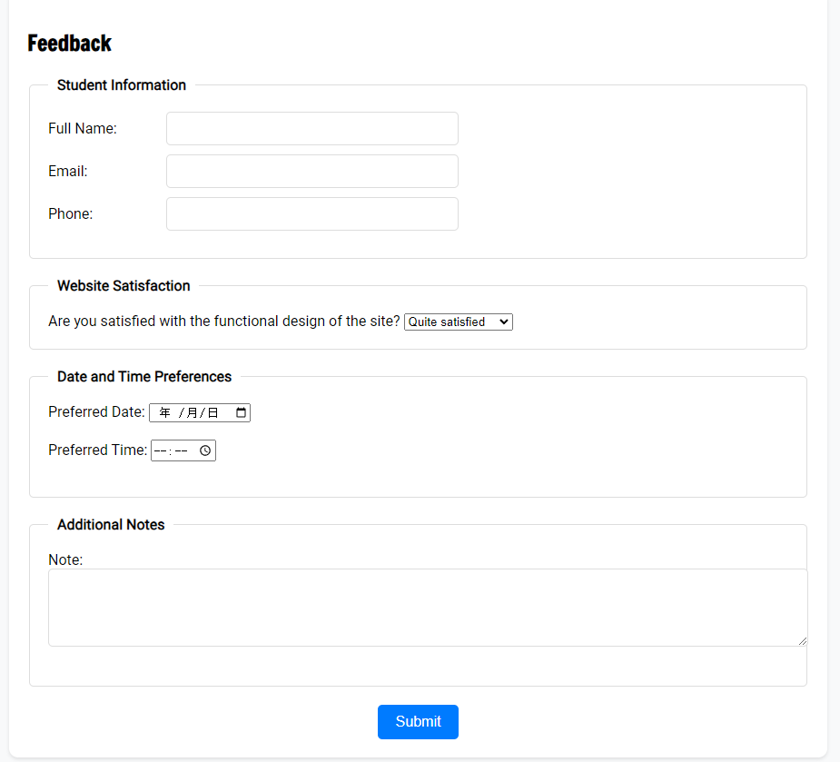

# User story title: Feedback
## Priority: 40
This is the latest priority for iteration-3.

## Estimation: 3 days
* Jiahao Song: 4 days (estimated before iteration-3)
* Jiale Tan: 2 days(estimated before iteration-3)

## Assumptions (if any):
Visitors to the site can leave feedback messages and user information to give feedback on aspects of the site's functionality

## Description: Later logins require verifying the existence of the account from the database
Description-v1:Simple design of the feedback interface.
Description-v2:The information in the feedback form is saved to database

## Tasks,see chapter 4
1. Task 1: Create feedback interface, Estimation 1 day
2. Task 2: completed feedback form function Estimation 1 day
3. Task 3: connect this feedback to database, Estimation 1 day
4. Task 4: Add styling to the interface, Estimation 1 day

# UI Design:!
* 
* https://www.figma.com/design/x5H44M9Qn34B1flDiPB7gV/CP3407?node-id=0- 1&t=J5QMXXerU4TbwwtP-0

# Completed:
## version-1
* 
## version-2
* 
## version-3
* 

