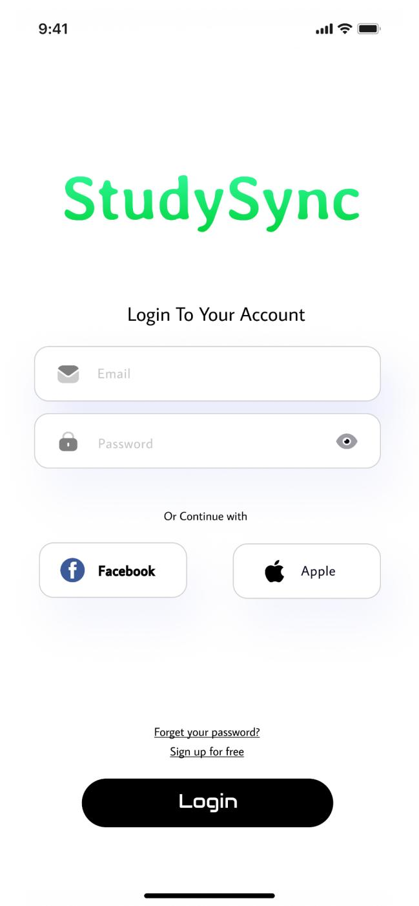

# User story title: login in
## Priority: 10 (latest for iteration-1)
## Priority: 10 (latest for iteration-2)
## Priority: 20 (latest for iteration-3)

## Estimation: 3 days
* Jiahao Song: 2 day(implement function)
* Jiale Tan: 2 day(Design the look and feel of your website)

## Assumptions (if any):
only those who have information save in the database can successfully log in.

## Description: Later logins require verifying the existence of the account from the database
Description-v1:Later logins will include a verification step to ensure the account exists in the database before granting access.

Description-v2:The login page interface has been styled to enhance user experience. Additionally, a secure connection to the database has been established to verify user accounts during login attempts.

Description-v3:Backend functionality has been added to verify user credentials against the database during login. Users without registered accounts are unable to access the system.

## Tasks, see chapter 3
1. Task 1: Add styling to the interface, Estimation 1 day
2. Task 2: Create database connection, Estimation 1 day
3. Task 3: When people log in, people need to verify that the database has this account. If it does not, it cannot log in

# UI Design:!
*
* https://www.figma.com/design/x5H44M9Qn34B1flDiPB7gV/CP3407?node-id=0- 1&t=J5QMXXerU4TbwwtP-0

# Completed:
# version1 

# version2 add a login later button
 
