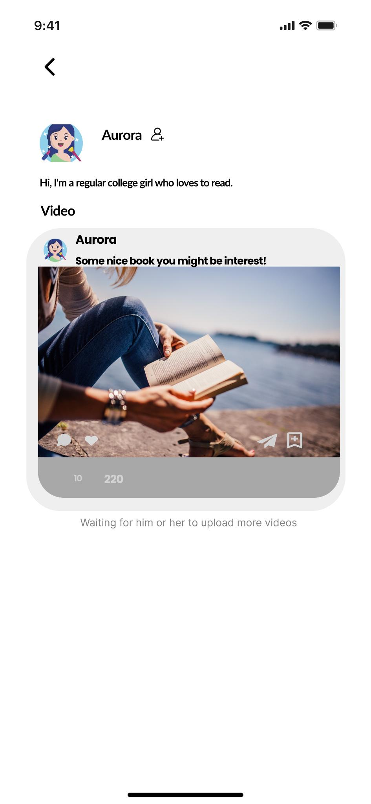
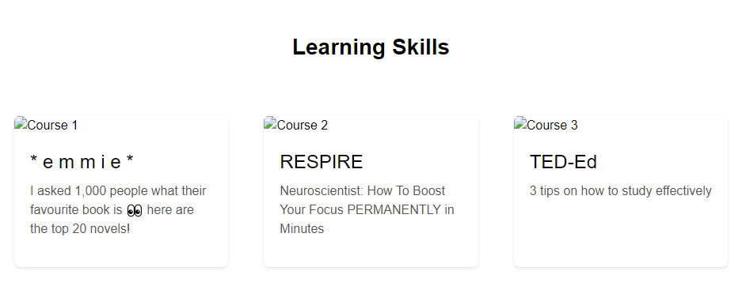
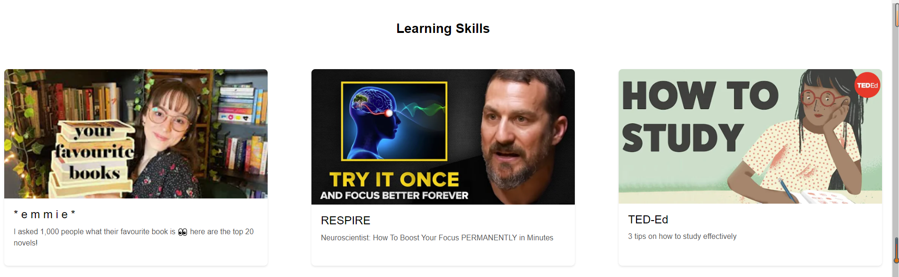

# User story title: online_video
## Priority: 20 (latest for iteration-2)
## Priority: 40 (latest for iteration-3)

## Estimation: 2 days
* Jiahao Song: 1 day(implement function)
* Jiale Tan: 1 day(Design the look and feel of your website)

## Assumptions (if any):
Access to sourced videos

## Description: Later logins require verifying the existence of the account from the database
Description-v1:Users can click on the connection and jump to the video playback

## Tasks, see chapter 3
1. Task 1: Add styling to the interface, Estimation 1 day
2. Task 2: Create URL connection, Estimation 1 day

# UI Design:!
*
* https://www.figma.com/design/x5H44M9Qn34B1flDiPB7gV/CP3407?node-id=0- 1&t=J5QMXXerU4TbwwtP-0

# Completed:
# version1

# version2 

