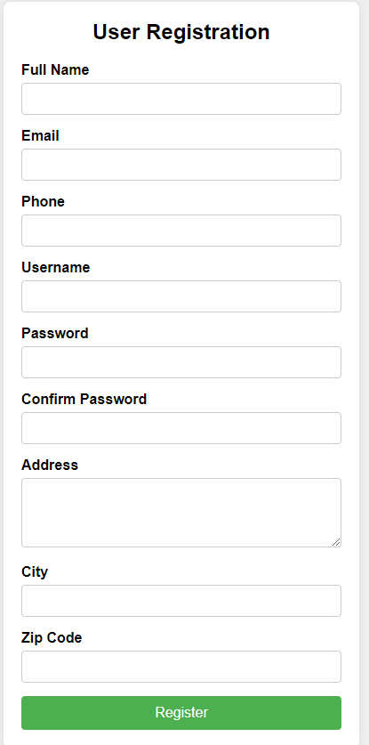
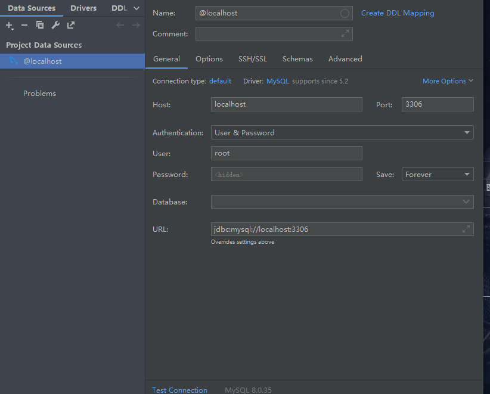
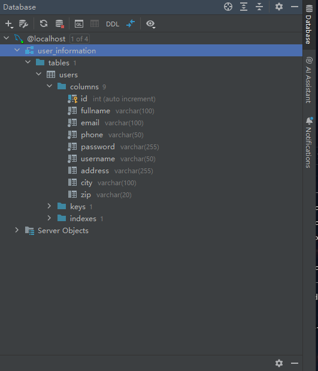
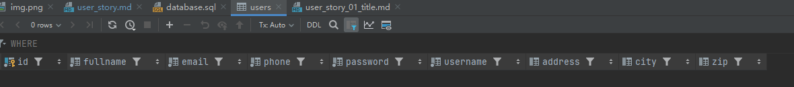
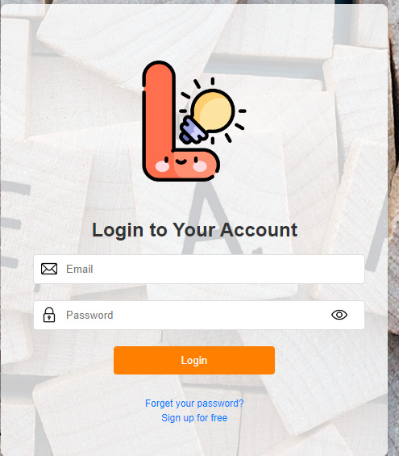

# User story title: sign up
## Priority: 10
This is the latest priority for iteration-1.

## Estimation: 3 days
* Jiahao Song: 4 day (e.g. estimated before iteration-1)
* 

## Assumptions (if any):
Once registered, the data will be stored in the database

## Description: Later logins require verifying the existence of the account from the database
Description-v1:Simple design of the sign-up interface.
Description-v2:The information in the sign-up form is saved

## Tasks,see chapter 4
1. Task 1: Create database connection, Estimation 1 day
2. Task 2: Save the data in the database Estimation 1 day
3. Task 3: Login requires verification that the data is in the database, Estimation 1 day
4. Task 4: Add styling to the interface, Estimation 1 day

# UI Design:!

# Completed:

# User story title: login in
## Priority: 10
This is the latest priority for iteration-1.

## Estimation: 3 days
* Jiahao Song: 2 day 
* Jiale Tan: 2 day

## Assumptions (if any):
only those who have information save in the database can successfully log in.

## Description: Later logins require verifying the existence of the account from the database
Description-v1:Later logins will include a verification step to ensure the account exists in the database before granting access.

Description-v2:The login page interface has been styled to enhance user experience. Additionally, a secure connection to the database has been established to verify user accounts during login attempts.

Description-v3:Backend functionality has been added to verify user credentials against the database during login. Users without registered accounts are unable to access the system.

## Tasks, see chapter 3
1. Task 1: Add styling to the interface, Estimation 1 day
2. Task 2: Create database connection, Estimation 1 day
3. Task 3: When people log in, people need to verify that the database has this account. If it does not, it cannot log in

# UI Design:!

# Completed:

# User story title: creat course

Keep any other version here as well, e.g. Display current deals, Let user to click on "show-current-deals".

## Priority: 20 (e.g. latest for iteration-1)
Any notes on priority go here.
Note you may have different priorities at different stages of you project.
Again, keep all changes here for marking.

## Estimation: e.g. 2 days
Any notes on estimation go here. Keep your planning poker game numbers. For example
* Bob: 1 day (e.g. estimated before iteration-1)
* Lisa: 2 days
* Jack: 3 days

## Assumptions (if any):

## Description: e.g. The web page will show current deals to Orion's orbits users
You need to keep all versions here so that your instructor/marker can see your changes easily.
In a real project, your older versions could be viewed via commits.

Description-v1: e.g. The web site will show current deals to Orion's orbits users

## Tasks, see chapter 4.

1. Task 1, Estimation XX days
2. ...

# UI Design:
* (New, not in the textbook)
* Many user stories are connected to a User interface.
* Insert a mockup design screenshot using any prototyping tools, e.g. [https://ninjamock.com/](https://ninjamock.com/)

# Completed:
* (New, not in the textbook)
* Insert screenshots of completed.
* If you have multiple versions (changes between iteractions), show them all.

