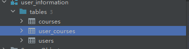

# User story title: sign up
## Priority: 10
This is the latest priority for iteration-1.

## Estimation: 3 days
* Jiahao Song: 4 day (e.g. estimated before iteration-1)
* 

## Assumptions (if any):
Once registered, the data will be stored in the database

## Description: Later logins require verifying the existence of the account from the database
Description-v1: Later logins require verifying the existence of the account from the database

## Tasks:
1. Task 1: Create database connection, Estimation 1 day
2. Task 2: Save the data in the database Estimation 1 day
3. Task 3: Login requires verification that the data is in the database, Estimation 1 day
4. Task 4: Add styling to the interface, Estimation 1 day

# UI Design:

# Completed:

# User story title: login in
## Priority: 10
This is the latest priority for iteration-1.

## Estimation: 3 days
* Jiahao Song: 2 day 
* Jiale Tan: 2 day

## Assumptions (if any):
Once registered, the data will be stored in the database

## Description: Later logins require verifying the existence of the account from the database
Description-v1: Later logins require verifying the existence of the account from the database

## Tasks:
1. Task 1: Add styling to the interface, Estimation 1 day
2. Task 2: Create database connection, Estimation 1 day
3. Task 3: When people log in, people need to verify that the database has this account. If it does not, it cannot log in

# UI Design:!

# Completed:

# User story title: Information fill
## Priority: 10
This is the latest priority for iteration-1.

## Estimation: 1 days
* Jiahao Song: 1 day
* Jiale Tan: 1 day

## Assumptions (if any):
Once registered, the data will be stored in the database

## Description: Later logins require verifying the existence of the account from the database
Description-v1: Later logins require verifying the existence of the account from the database

## Tasks:
1. Task 1: Add styling to the interface, Estimation 1 day
2. Task 2: Create database connection, Estimation 1 day
3. Task 3: When people log in, people need to verify that the database has this account. If it does not, it cannot log in

# UI Design:!

# Completed:

