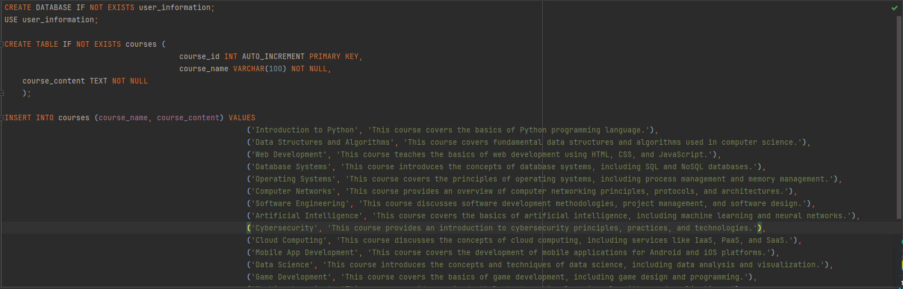

# User story title: sign up
## Priority: 10
This is the latest priority for iteration-1.

## Estimation: 3 days
* Jiahao Song: 4 day (e.g. estimated before iteration-1)
* 

## Assumptions (if any):
Once registered, the data will be stored in the database

## Description: Later logins require verifying the existence of the account from the database
Description-v1:Simple design of the sign-up interface.
Description-v2:The information in the sign-up form is saved

## Tasks,see chapter 4
1. Task 1: Create database connection, Estimation 1 day
2. Task 2: Save the data in the database Estimation 1 day
3. Task 3: Login requires verification that the data is in the database, Estimation 1 day
4. Task 4: Add styling to the interface, Estimation 1 day

# UI Design:!

# Completed:

# User story title: login in
## Priority: 10
This is the latest priority for iteration-1.

## Estimation: 3 days
* Jiahao Song: 2 day 
* Jiale Tan: 2 day

## Assumptions (if any):
only those who have information save in the database can successfully log in.

## Description: Later logins require verifying the existence of the account from the database
Description-v1:Later logins will include a verification step to ensure the account exists in the database before granting access.

Description-v2:The login page interface has been styled to enhance user experience. Additionally, a secure connection to the database has been established to verify user accounts during login attempts.

Description-v3:Backend functionality has been added to verify user credentials against the database during login. Users without registered accounts are unable to access the system.

## Tasks, see chapter 3
1. Task 1: Add styling to the interface, Estimation 1 day
2. Task 2: Create database connection, Estimation 1 day
3. Task 3: When people log in, people need to verify that the database has this account. If it does not, it cannot log in

# UI Design:!

# Completed:

# User story title: Information fill(same function to register interface)
## Priority: 10
This is the latest priority for iteration-1.

## Estimation: 1 days
* Jiahao Song: 1 day
* Jiale Tan: 1 day

## Assumptions (if any):
the data will be stored in the database when registered information completed

## Description-v1: Later logins require verifying the existence of the account from the database
Later logins will include a verification step to ensure the account exists in the database before granting access.

## Tasks:
1. Task 1:Design and Implement Information Fill Interface, Estimation 1 day
2. Task 2: Backend Logic and Database Integration, Estimation 1day
3. Task 3: Login Verification Functionality, Estimation 1day
4. Task 4: Access Control ,Estimation 1 day

# UI Design:!

# Completed:
# this is fill information screenshot
 
# this is show this fill information have already saved in database.
 

